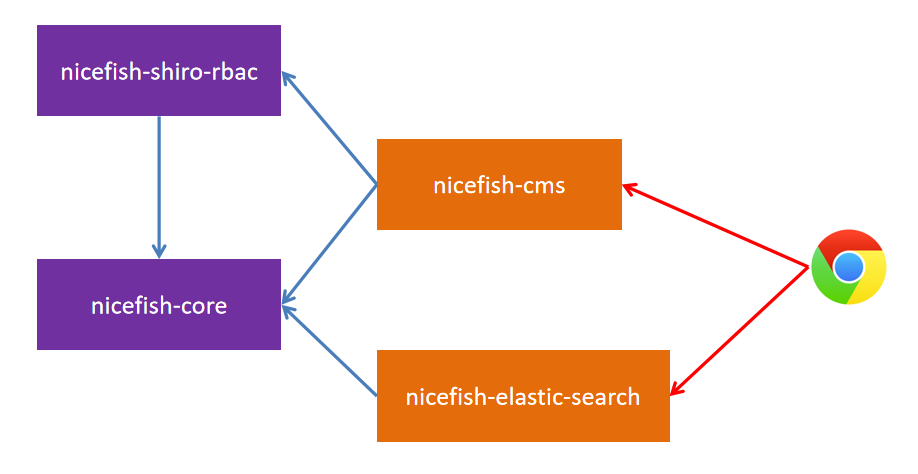

    

<h1 align="center">NiceFish</h1>

NiceFish（美人鱼） 是一个系列项目，目标是示范前后端分离的开发模式:前端浏览器、移动端、Electron 环境中的各种开发模式；后端有两个版本：SpringBoot 版本和 SpringCloud 版本。

【正在不断扩充功能】

## 开发环境

- 开发工具 IDEA
- VS Code
- MySQL 5 以上版本，MariaDB 10 以上版本
- Redis
- Nginx

## 用法

- git clone 本项目
- 用 IDEA 导入根目录下的 pom.xml
- 在 IDEA 中安装lombok插件（需要安装lombok插件，方便使用注解的方式写日志）
  
- 在 MySQL 中导入 docs/nicefish_springboot.sql 脚本
- 配置 Maven ，使用阿里云的源
- 修改 application.yml 配置文件，把 MySQL 和 Redis 改成你本地的用户名和端口
- 启动 nicefish-cms

## Maven 模块依赖关系

- nicefish-core: 提供通用的工具
- nicefish-auth-shiro: 提供基于Shiro的通用认证和鉴权服务
- nicefish-staff-org: 提供经典的树形组织机构和员工管理
- nicefish-cms: 基于以上基础模块的内容管理应用

## 前后端分离模式下的开发方式

在前后端分离开发、分离部署的模式下，与传统的开发环境有一些区别。为了让 cookie 和 session 机制能生效，我们必须对 nginx 做一些配置。

### 配置nginx

我本地的关键配置如下：

    server {
        listen       80;
        server_name  localhost;
        # 这里需要改成你本地的前端代码目录
        root /home/ubuntu/workspace/nicefish-angular/;
        index index.html;
        
        location / {
            try_files $uri $uri/ /index.html;
        }
        
        location /nicefish {
            add_header From nicefish;
            proxy_pass http://localhost:8080/nicefish;
            proxy_set_header X-Forwarded-Proto $scheme;
            proxy_set_header X-Forwarded-Port $server_port;
            proxy_set_header Remote_Addr $remote_addr;
            proxy_set_header Host $host;
            proxy_set_header X-Real-IP $remote_addr;
            proxy_set_header X-Forwarded-For $proxy_add_x_forwarded_for;
            proxy_set_header Cookie $http_cookie;
            proxy_redirect default;
            proxy_buffering off;
            proxy_cookie_path ~*^/.* /;
            proxy_intercept_errors on;
        }
        
        location ~ \.(html|js|css|png|jpg|jpeg|gif|ico|json|woff2|eot|ttf|svg|woff)$ {
            # 这里需要改成你本地的前端代码目录
            root /home/ubuntu/workspace/nicefish-angular/;
        }
    }

### VS Code

然后在 VS Code 里面用这种方式来实时编译 Angular 代码：

对应的前端代码在这里： http://git.oschina.net/mumu-osc/NiceFish/

**注意：本项目与具体的前端框架无关，所有接口都是Restful的，所以你可以使用任意前端框架来接入。**

## Swagger 接口

- 项目起来之后访问 http://localhost:8080/swagger-ui.html

## 界面截图

## 系列项目

|  名称   | 描述  |
|  ----  | ----  |
| NiceFish（美人鱼）  | 这是一个系列项目，目标是示范前后端分离的开发模式:前端浏览器、移动端、Electron 环境中的各种开发模式。后端有两个版本：SpringBoot 版本和 SpringCloud 版本，Angular 版本的前端代码基于 Angular 8.0 + PrimeNG 7.1.0。http://git.oschina.net/mumu-osc/NiceFish/ |
| nicefish-ionic  | 这是一个移动端的 demo，基于 ionic，此项目已支持 PWA。http://git.oschina.net/mumu-osc/nicefish-ionic |
| NiceBlogElectron  | 这是一个基于 Electron 的桌面端项目，把 NiceFish 用 Electron 打包成了一个桌面端运行的程序。这是由 ZTE 中兴通讯的前端道友提供的，我 fork 了一个，有几个 node 模块的版本号老要改，如果您正在研究如何利用 Electron 开发桌面端应用，请参考这个项目，https://github.com/damoqiongqiu/NiceBlogElectron|
| OpenWMS  | 用来示范管理后台型系统的最佳实践，https://gitee.com/mumu-osc/OpenWMS-Frontend|
| nicefish-springboot  | 用来示范前后端分离模式下，前端代码与后端服务的对接方式，https://gitee.com/mumu-osc/nicefish-spring-boot 。|
| nicefish-springcloug  | 用来示范前后端分离模式下，前端代码与分布式后端服务的对接方式，即将完成，代码最近放出。|

## 主要依赖

- JDK > 8.0
- spring-boot 2.1.1
- apache shiro > 1.4.0
- druid 1.1.14
- jpa
- redis

## 开源许可证

MIT
